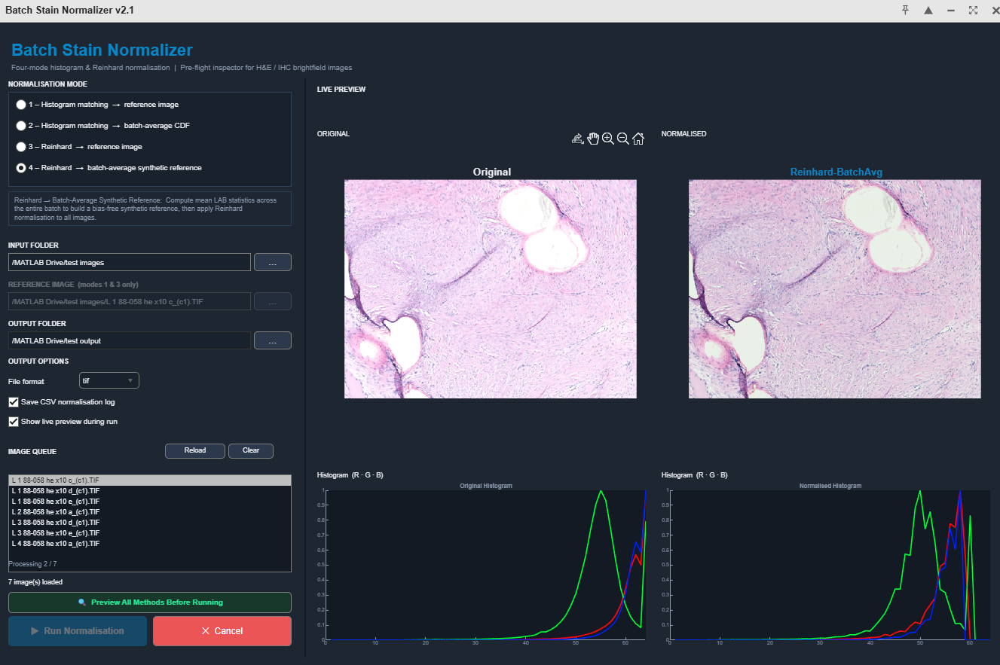
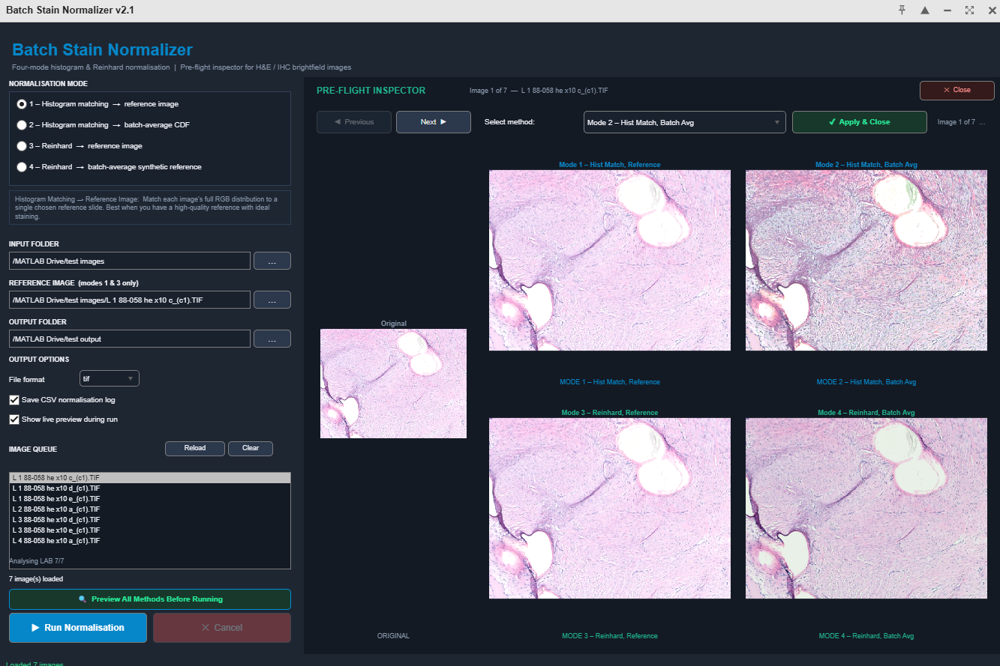

Chameleon
Batch stain normalization for H&E and IHC brightfield histology images


[]()

---




---
Overview
Stain variability between slides, scanners, and batches is one of the most common pre-processing challenges in digital pathology. Chameleon provides a clean, GUI-based workflow for correcting this variability using four normalization methods, with a Pre-flight Inspector that lets you compare all four methods side by side on your own images before committing to a full batch run.
Available as both a MATLAB app (works in MATLAB Online) and a standalone Python application.
---
Features
Four normalization modes spanning two algorithms (histogram specification and Reinhard color transfer) with two reference strategies (explicit reference image or batch-derived synthetic reference)
Pre-flight Inspector — preview all four methods on any image in your batch before running, with ◀ ▶ navigation through the full queue
Batch-average synthetic reference — no need to choose a reference slide; Chameleon computes one automatically from your data
CSV normalization log with per-image, per-channel statistics (mean, std, Wasserstein distance or delta-E)
Parallel processing in the Python version (configurable worker count)
Supports `.tif`, `.tiff`, `.jpg`, `.jpeg`, `.bmp` input (case-insensitive)
MATLAB Online compatible — no desktop installation required
---
The Four Modes
Mode	Algorithm	Reference	Best for
1	Histogram matching	User-chosen reference image	Strong correction when you have an ideal reference slide
2	Histogram matching	Batch-average CDF	Fast, unbiased correction with no reference needed
3	Reinhard color transfer	User-chosen reference image	Conservative correction; lower artefact risk for IHC
4	Reinhard color transfer	Batch-average synthetic reference	Unbiased Reinhard normalization; no reference needed
Not sure which to use? Open the Pre-flight Inspector and compare all four visually on your own images before deciding.
Histogram Specification (Modes 1 & 2)
Maps each image's per-channel intensity distribution to match a target CDF using a 256-entry lookup table. Fast and deterministic. Mode 2 builds the target by averaging histograms across the entire batch.
Reinhard Color Transfer (Modes 3 & 4)
Transfers color statistics in LAB color space using the formula:
```
output = (source − src_mean) / src_std × tgt_std + tgt_mean
```
More conservative than histogram matching — shifts and scales the distribution without forcing a full shape match. Mode 4 builds the synthetic target by averaging LAB statistics across the entire batch.
---
Pre-flight Inspector


Before running a full batch, click 🔍 Preview All Methods Before Running to open the inspector. It shows:
The original image on the left
A 2×2 grid of all four normalized results — large enough to see staining differences clearly
◀ Previous / Next ▶ navigation through every image in your queue
A Select method dropdown and ✔ Apply & Close button that sets your chosen mode automatically
Modes 1 and 3 require a reference image to be set. Modes 2 and 4 are always available.
---
Installation
Python version (recommended for standalone use)
```bash
pip install PyQt6 matplotlib numpy scikit-image Pillow
python run_normalizer.py
```
> **Windows / Anaconda users:** If you encounter a PyQt6 DLL error, install via conda instead:
> ```bash
> conda install -c conda-forge pyqt
> pip install matplotlib scikit-image Pillow
> python run_normalizer.py
> ```
MATLAB version
Requires MATLAB R2019b or later with the Image Processing Toolbox.
```matlab
run_Chameleon
```
Works directly in MATLAB Online — no desktop installation required.
---
Packaging as a Standalone Executable (Python)
No Python installation required on the target machine.
```bash
pip install pyinstaller
pyinstaller --onefile --windowed --name "Chameleon" run_normalizer.py
```
The executable will appear in the `dist/` folder.
---
Usage
Recommended workflow
Browse to your input folder — supported images load automatically
For Modes 1 or 3: browse to a reference image
Browse to an output folder
Click 🔍 Preview All Methods to compare all four normalizations side by side
Select your preferred method and click ✔ Apply & Close
Click ▶ Run normalization
Choosing a mode
Situation	Recommended
You have one ideal reference slide	Mode 1 (aggressive) or Mode 3 (conservative)
No reliable reference image	Mode 2 or Mode 4
H&E, same scanner, moderate batch drift	Mode 2 — fast and effective
IHC with variable DAB/haematoxylin ratio	Mode 4 — lower artefact risk
Unsure	Open the Pre-flight Inspector and compare visually
---
Outputs
normalized images are saved to the chosen output folder with `_norm` appended to the filename.
If Save CSV normalization log is enabled, a timestamped log is written alongside the images.
CSV log columns
Histogram modes (1 & 2):
`Filename, Channel (R/G/B), OrigMean, OrigStd, NormMean, NormStd, WassersteinDist`
Reinhard modes (3 & 4):
`Filename, Channel (L/a/b), OrigMean_LAB, OrigStd_LAB, NormMean_LAB, NormStd_LAB, DeltaE_mean`
The Wasserstein distance quantifies how much the distribution was shifted — higher values indicate images that were strong outliers before normalization. The delta-E is the mean per-pixel LAB colour difference between original and normalized.
---
Requirements
Python version
Package	Version
Python	≥ 3.9
PyQt5 or PyQt6	≥ 5.15 / 6.4
NumPy	≥ 1.24
scikit-image	≥ 0.21
Pillow	≥ 9.0
Matplotlib	≥ 3.7
MATLAB version
Requirement	Notes
MATLAB R2019b or later	Required for App Designer components
Image Processing Toolbox	`imhist`, `rgb2lab`, `lab2rgb`, `imwrite`, `ssim`
---
Supported Formats
Input: `.tif`, `.tiff`, `.jpg`, `.jpeg`, `.bmp` (case-insensitive — `.TIF` and `.tif` both work)
Output: `.tif` (LZW lossless, recommended), `.jpg` (maximum quality), `.bmp`
Automatically handles: 16-bit TIFF, grayscale images, RGBA (alpha channel dropped).
---
Repository Structure
```
Chameleon/
├── LICENSE
├── README.md
├── AUTHORS.md
├── docs/
│   └── screenshot.png          ← add your screenshot here
├── MATLAB/
│   ├── Chameleon.m             ← main application
│   └── run_Chameleon.m         ← launcher
└── Python/
    ├── normalizer_app.py       ← GUI application
    ├── normalizer_core.py      ← algorithms (no GUI dependency)
    ├── run_normalizer.py       ← launcher / PyInstaller entry point
    └── requirements.txt
```
---
Citation
If you use Chameleon in your research, please cite:
```bibtex
@software{turner2026chameleon,
  author  = {Turner, Neill},
  title   = {Chameleon: Batch Stain normalization for Histology Images},
  year    = {2026},
  url     = {https://github.com/chameleon-histo/Chameleon},
  version = {1.0}
}
```
---
About
Chameleon was created by Neill Turner, PhD, a biomedical scientist with 20+ years of experience in digital pathology, biomaterials, and preclinical image analysis. It was built as an open-source tool for the digital pathology and computational biology community.
See AUTHORS.md for full author information.
---
Contributing
Contributions welcome. Please open an issue to discuss proposed changes before submitting a pull request.
Planned future features:
OpenSlide support for whole-slide image (WSI) tiles
GPU acceleration via CuPy
Macenko stain separation as a fifth normalization mode
---
License
MIT License — see LICENSE for details.
---
Created by Neill Turner, PhD — open-source tool for the digital pathology and computational biology community.
